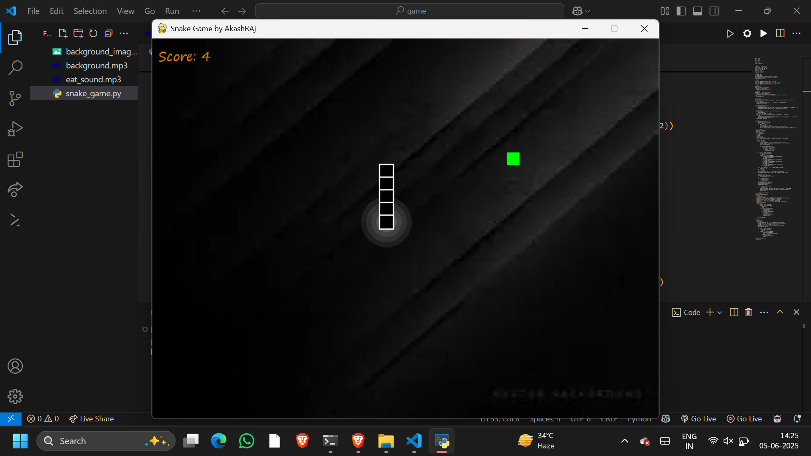

# 🐍 Snake Game by Akash Raj

Welcome to the classic **Snake Game** developed in **Python** using the **Pygame** library!  
This version features custom difficulty levels, sound effects, colorful graphics, score tracking, and responsive controls.


## 📸 Screenshot

  


## 🚀 Features

- 🟢 Difficulty selection (Easy, Medium, Hard)
- 🎵 Background music & sound effects
- 🌈 Visual effects (aura around snake head)
- 🍎 Smooth and responsive gameplay
- 💯 Real-time score display
- 🎨 Themed colors and background support

## 🛠️ Tech Stack

- [Python 3](https://www.python.org/)
- [Pygame](https://www.pygame.org/)

## 📁 File Structure

snake-game/
├── snake_game.py
├── background_image.jpg # Optional background image
├── eat_sound.mp3 # Snake eats food sound
├── assets/
│ └── screenshot.png # Screenshot of the game
├── README.md

markdown
Copy
Edit

## ⚙️ How to Run

1. Make sure you have **Python 3** and **Pygame** installed:

```bash
pip install pygame
Clone the repository and run the game:

bash
Copy
Edit
git clone https://github.com/your-username/snake-game.git
cd snake-game
python snake_game.py
🎮 Controls
Arrow Keys – Move the snake

1, 2, 3 – Choose difficulty (Easy, Medium, Hard)

C – Continue after losing

Q – Quit the game


🧑‍💻 Author
Akash Raj
